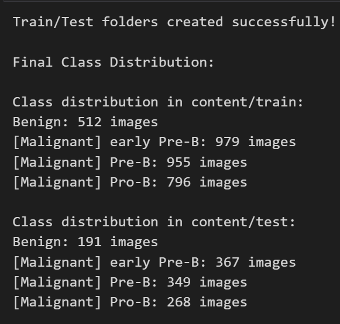
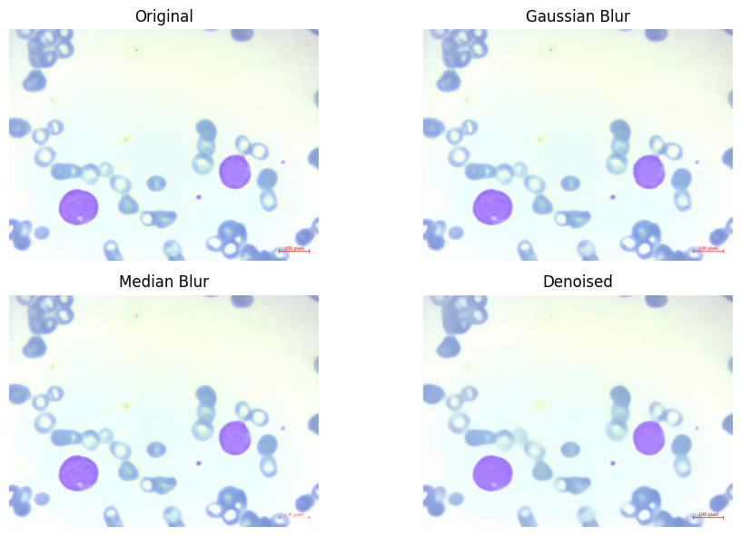
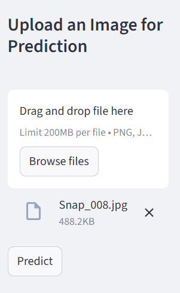
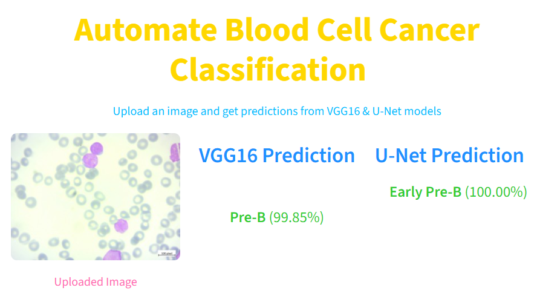

# 🩸 Blood Cancer Classification Using Deep Learning

This repository presents a deep learning pipeline for **automated blood cancer classification**, focusing on distinguishing benign cells from three malignant subtypes. The project uses **VGG16** and a **Custom U-Net** (adapted for classification), achieving high accuracy and robust performance suitable for research and real-world clinical applications.

---
### 📸 Preview Images
## 📊 Dataset Overview
Below are a few sample images from the dataset along with class distribution.

<p align="center">
  
  
  
</p>

## 🧹 Data Preprocessing
Below are examples showing how the images were cleaned and augmented.

<p align="center">
    
</p>

## 🧠 Model Architecture & Training
Model architecture and training performance graphs:

<p align="center">
  
  
</p>

## 📈 Evaluation Results
Key visual evaluations of the model:

<p align="center">
  
  
  
  
</p>

## 💻 Web App Preview (app.py)
Below are the screenshots of the deployed app built with Streamlit/Gradio.

<p align="center">
  
  
</p>

## 📌 Table of Contents
- [Project Overview](#project-overview)
- [Dataset](#dataset)
- [Preprocessing](#preprocessing)
- [Models](#models)
- [Training](#training)
- [Evaluation](#evaluation)
- [Usage](#usage)
- [Project Structure](#project-structure)
- [Results](#results)
- [Contact](#contact)

---

## 📍 Project Overview

Blood cancer is a severe disease where **early diagnosis** is crucial.  
This project builds a **deep learning–based detection system** that classifies blood cell microscopic images into:

- **Benign**
- **Early Pre-B**
- **Pre-B**
- **Pro-B**

Two different model architectures are used:

### 🔹 VGG16 (Transfer Learning)
- Pretrained on ImageNet  
- Frozen base layers, trainable dense layers  
- Excellent for feature extraction  

### 🔹 Custom U-Net (for Classification)
- Encoder–decoder architecture  
- Includes group normalization  
- Modified for **image classification**, not segmentation  
- Works exceptionally well with medical images  

---

## 📁 Dataset

The dataset is sourced from Kaggle:

🔗 **Blood Cell Cancer Dataset**  
https://www.kaggle.com/datasets/mohammadamireshraghi/blood-cell-cancer-all-4class

> ⚠️ *Dataset is not included in this repo due to file size.*  
> Download it manually and place inside the following folder:  
 `content/Blood cell Cancer [ALL]` 
 
### 🔹 Classes Included
- Benign  
- Early Pre-B  
- Pre-B  
- Pro-B  

---

## 🛠️ Preprocessing

To enhance image quality and remove noise:

- Gaussian Blur  
- Median Blur  
- Non-Local Means Denoising  
- Image resizing → **150×150**

These steps make the dataset more uniform and improve model generalization.

---

## 🧠 Models

### **1️⃣ VGG16 Architecture**
- Pretrained base  
- Custom dense classifier  
- 4-class softmax output  
- Strong performance with limited data  

### **2️⃣ Custom U-Net**
- Encoder–decoder  
- Skip connections  
- Group Normalization  
- Designed for classification  
- Trained from scratch  

---

## 🏋️ Training

- Train/Test split: **95% / 5%**
- Image augmentation:
  - rotation  
  - shifting  
  - shearing  
  - zoom  
  - horizontal/vertical flips  
- Batch size:
  - Train/Val: **10**
  - Test: **1**
- Epochs: **10**
- Early stopping + checkpointing for U-Net

---

## 📊 Evaluation

Both models were evaluated on the test set:

| Model   | Test Loss | Test Accuracy |
|---------|-----------|---------------|
| **VGG16** | 0.0831 | **97.02%** |
| **U-Net** | 0.1150 | **97.62%** |

Confusion matrices and classification reports are included inside the notebook.

---

## ▶️ Usage

### **1. Clone the repository**
```bash
git clone https://github.com/antoracse/blood-cancer-classification.git
cd blood-cancer-classification
```
## 🚀 Installation & Setup

### 📦 Install Dependencies
```bash
pip install -r requirements.txt
```

### ▶️ Run the Streamlit App
Models will auto-download from Google Drive using gdown.

```bash
python app.py
```

Upload any blood microscope image and get predictions from both VGG16 and U-Net models.

---

## 📂 Project Structure
```
blood-cancer-classification/
│
├── images/                          # Preview images 
│
├── models/                          # Saved model weights
│   ├── Custom_unet_model.h5
│   ├── vgg16_model.h5
│
├── notebook/
│   ├── blood_cancer.ipynb           # Training & experimentation notebook
│   ├── content/
│       ├── Blood cell Cancer [ALL]/ # Raw dataset (ignored in git)
│       ├── train/
│       ├── test/
│
├── best_unet_model.h5               # Final chosen model (ignored in git)
│
├── venv/                            # Virtual environment (ignored in git)
│
├── web_app/
│   ├── app.py                       # Flask application
│   ├── run_app.bat                  # Windows runner
│   ├── test/                        # Test images for app
│
├── .gitignore
├── README.md

```
---

## 📊 Results

| Model   | Accuracy |
|---------|----------|
| **VGG16** | **97.02%** |
| **U-Net** | **97.62%** |

Notebook includes:
- Confusion Matrices  
- Classification Reports  
- Sample Predictions  
- Loss & Accuracy Curves  

---

## 📬 Contact
- **Name:** Antora Akter  
- **Email:** antoraakter.cu@gmail.com  
- **GitHub:** https://github.com/antoracse

